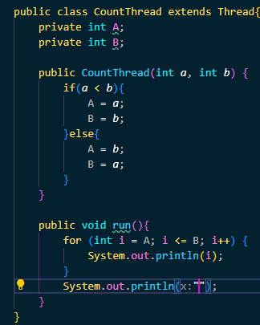
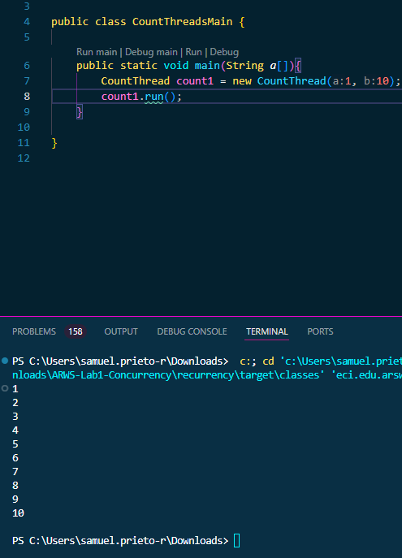
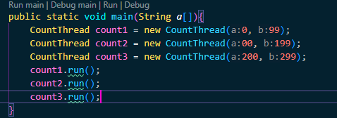
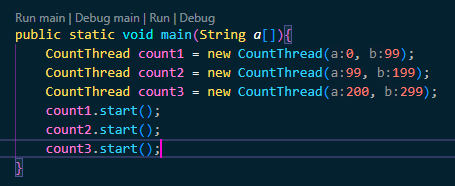
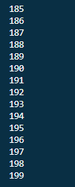
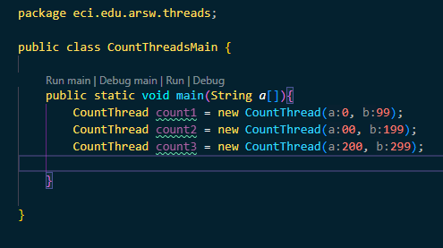

# ARWS-Lab1-Concurrency
## Hecho por: Alejandro Prieto Reyes

---
### Parte I - Introducción a Hilos en Java
#### 1. De acuerdo con lo revisado en las lecturas, complete las clases CountThread, para que las mismas definan el ciclo de vida de un hilo que imprima por pantalla los números entre A y B.
  
**Solucion:** Hice el constructor de la clase, buscando que A siempre sea menor que B y el metodo run, para correr este dentro de la misma en un for, le agrego un salto final con el fin de, si hay mas CountThread funcionando, se diferencie uno de otro   
  

**Funcionamiento:** Pusimos a iterar el ciclo entre 1 y 10.  
    

#### 2. Complete el método main de la clase CountMainThreads para que:

##### i. Cree 3 hilos de tipo CountThread, asignándole al primero el intervalo [0..99], al segundo [99..199], y al tercero [200..299]
  

##### ii. Inicie los tres hilos con 'start()'.
  

##### iii. Ejecute y revise la salida por pantalla
  
**Observacion:** Todo se hizo en "desorden" no hay un orden claro.

##### iv. Cambie el incio con 'start()' por 'run()'. Cómo cambia la salida?, por qué?
    
**Solucion:** Podemos observar, que la diferencia entre ejecutar el metodo run() y start() es que; run(), nos permite "separar" las ejecuciones *secuencialmente*, como si fuera un metodo "usual", en cambio, start(), las ejecuta todas al tiempo, abriendo un hilo mas por cada llamado (Para un total de 4, 3 de los metodos y 1 del main).

---
### Parte II - Ejercicio Black List Search
#### Cree una clase de tipo Thread que represente el ciclo de vida de un hilo que haga la búsqueda de un segmento del conjunto de servidores disponibles. Agregue a dicha clase un método que permita 'preguntarle' a las instancias del mismo (los hilos) cuantas ocurrencias de servidores maliciosos ha encontrado o encontró

#### Agregue al método 'checkHost' un parámetro entero N, correspondiente al número de hilos entre los que se va a realizar la búsqueda (recuerde tener en cuenta si N es par o impar!). Modifique el código de este método para que divida el espacio de búsqueda entre las N partes indicadas, y paralelice la búsqueda a través de N hilos. Haga que dicha función espere hasta que los N hilos terminen de resolver su respectivo sub-problema, agregue las ocurrencias encontradas por cada hilo a la lista que retorna el método, y entonces calcule (sumando el total de ocurrencuas encontradas por cada hilo) si el número de ocurrencias es mayor o igual a BLACK_LIST_ALARM_COUNT. Si se da este caso, al final se DEBE reportar el host como confiable o no confiable, y mostrar el listado con los números de las listas negras respectivas. Para lograr este comportamiento de 'espera' revise el método join del API de concurrencia de Java. Tenga también en cuenta:
- Dentro del método checkHost Se debe mantener el LOG que informa, antes de retornar el resultado, el número de listas negras revisadas VS. el número de listas negras total (línea 60). Se debe garantizar que dicha información sea verídica bajo el nuevo esquema de procesamiento en paralelo planteado
- Se sabe que el HOST 202.24.34.55 está reportado en listas negras de una forma más dispersa, y que el host 212.24.24.55 NO está en ninguna lista negra.

